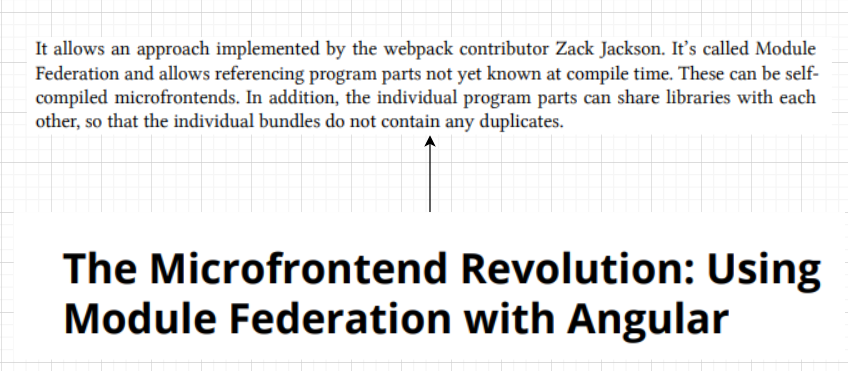
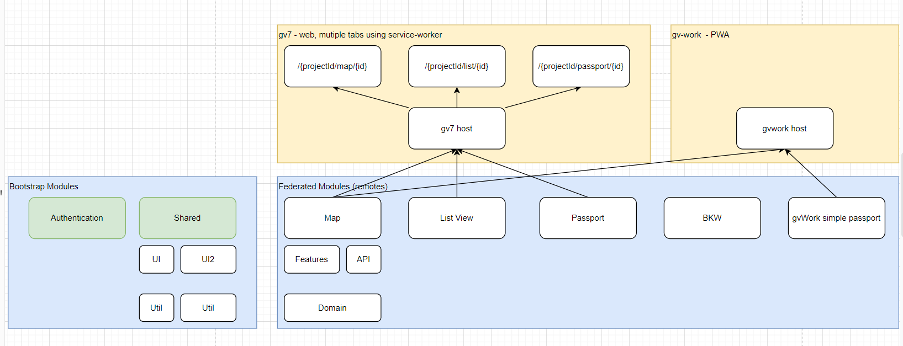
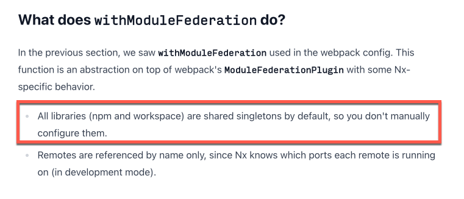

# ConxMfe

## using nx-workspace

https://levelup.gitconnected.com/your-first-angular-microfrontend-58950768a465

### 1. create workspace for angular

`npx create-nx-workspace@latest conx-mfe` default app gv

### 2. add more angular apps and libs with bindings

https://nx.dev/recipes/module-federation/dynamic-module-federation-with-angular

`npx nx g @nx/angular:host gv`

`npx nx g @nx/angular:remote map --host=gv`

`npx nx g @nx/angular:remote listview --host=gv`

`npx nx g @nx/angular:remote passport --host=gv`

`npx nx g @nx/angular:remote login --host=gv`

### 3. set up more hosts (gv)

already done--
`nx generate @nx/angular:application gv`

### 4. module federation bindings

### 5. remove app

`nx g @nx/workspace:remove my-feature-lib`

### 6. nx shared modules

#

# NX HELP

✨ **This workspace has been generated by [Nx, a Smart, fast and extensible build system.](https://nx.dev)** ✨

## Development server

Run `nx serve gv` for a dev server. Navigate to http://localhost:4200/. The app will automatically reload if you change any of the source files.

## Understand this workspace

Run `nx graph` to see a diagram of the dependencies of the projects.

## Remote caching

Run `npx nx connect-to-nx-cloud` to enable [remote caching](https://nx.app) and make CI faster.

## Further help

Visit the [Nx Documentation](https://nx.dev) to learn more.
